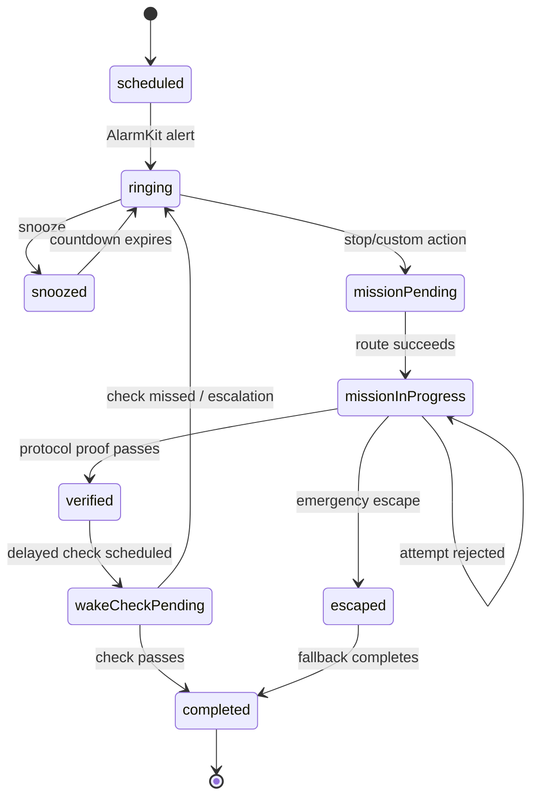

# Engineering Framework

## Platform decision

### MVP

- iOS 26+
- Swift 6
- SwiftUI
- iPhone-first
- local-first, accountless by default

### Later

- watchOS companion
- Apple Health read-only integration
- optional backend for referrals, accountability, and creator protocols

The minimum OS should not be lowered until the team proves that doing so preserves alarm reliability and does not require rebuilding the core around weaker notification behavior.

## Primary frameworks

| Concern | Framework |
|---|---|
| System alarm delivery | AlarmKit |
| Alert actions and routing | App Intents |
| Lock Screen/Dynamic Island | ActivityKit |
| UI | SwiftUI |
| Camera | AVFoundation |
| Visual feature extraction | Vision and Core ML |
| Motion/liveness support | Core Motion |
| Local persistence | SwiftData |
| Subscriptions | StoreKit 2 |
| Logging | OSLog |
| Background-safe identifiers | Foundation UUID and Codable models |
| Health data, later | HealthKit |
| Watch smart alarm, later | WatchKit `WKExtendedRuntimeSession` |

## Module boundaries

```text
WakeProof
├── AppShell
│   ├── RootNavigation
│   ├── DependencyContainer
│   └── AppIntentHandoff
├── AlarmCore
│   ├── AlarmDomain
│   ├── AlarmKitClient
│   ├── AlarmScheduler
│   ├── AlarmReconciliation
│   └── RecurrenceEngine
├── WakeSession
│   ├── WakeSessionCoordinator
│   ├── WakeSessionStateMachine
│   ├── EscalationPolicy
│   └── EmergencyEscapePolicy
├── MissionEngine
│   ├── MissionProtocol
│   ├── PhotoMission
│   ├── BarcodeMission
│   ├── CognitiveMission
│   └── WakeCheckMission
├── ProofEngine
│   ├── CameraCapture
│   ├── TargetRegistration
│   ├── FeatureExtraction
│   ├── VisualMatching
│   ├── Liveness
│   └── VerificationScoring
├── Persistence
│   ├── Models
│   ├── Repositories
│   └── Migrations
├── Reliability
│   ├── Diagnostics
│   ├── IncidentRecorder
│   └── ReliabilityCenter
├── Monetization
│   ├── Entitlements
│   ├── Products
│   └── PaywallPolicy
├── Analytics
│   ├── EventSchema
│   └── PrivacyFilter
└── WatchSupport
    ├── WatchConnectivity
    ├── SmartAlarmSession
    └── HealthSignalReader
```

## Dependency direction

- Views depend on domain interfaces, not concrete AlarmKit, camera, or StoreKit types.
- Domain logic does not import SwiftUI.
- Proof scoring returns typed results and diagnostic reasons.
- AlarmKit is wrapped behind an adapter that can be faked in tests.
- Time is injected through a clock abstraction.
- Persistence is accessed through repositories.
- Monetization never controls the ability to stop an alarm.
- Analytics observes outcomes; it does not own business state.

## Wake-session state machine



Invalid transitions must be rejected and logged. State transitions should be idempotent because App Intents, scene activation, and reconciliation can deliver repeated signals.

## Core domain models

### Alarm

- stable identifier;
- local schedule;
- recurrence;
- latest acceptable wake time;
- protocol identifier;
- snooze policy;
- commitment policy;
- enabled state;
- AlarmKit reconciliation metadata;
- last scheduling result;
- last incident status.

### Wake protocol

- ordered missions;
- completion policy;
- fallback policy;
- delayed-check policy;
- accessibility alternatives;
- strictness level;
- version.

Protocols are versioned so an alarm session remains reproducible even if the user edits the template later.

### Wake session

- session identifier;
- alarm identifier;
- scheduled date;
- actual alert date;
- state;
- mission attempts;
- proof confidence and reason codes;
- snooze events;
- escape events;
- wake-check events;
- terminal outcome;
- diagnostic bundle reference.

Never place raw camera images in general session analytics.

## Persistence strategy

- SwiftData for user-facing configuration and session summaries.
- File-protected local storage for visual target representations.
- Separate transient storage for capture frames; delete immediately after feature extraction unless the user explicitly opts into a local debug report.
- Persist enough alarm metadata to rebuild or reconcile AlarmKit state after process death.
- Use migration tests before every schema change.
- Avoid iCloud for sensitive health information. Camera-target sync is off by default and requires a separate privacy review.

## Alarm reconciliation

At app activation, authorization changes, time-zone changes, and relevant AlarmKit updates:

1. Read local enabled alarms.
2. Read AlarmKit alarms owned by WakeProof.
3. Match by stable encoded identifier.
4. Detect missing, stale, duplicate, and orphaned records.
5. Repair only when the intended state is unambiguous.
6. Surface unresolved conflicts in Reliability Center.
7. Emit privacy-safe diagnostic events.

## App Intent handoff

Use one predictable routing surface:

- Alarm identifier is encoded in the intent.
- Intent writes a small handoff payload to shared app state.
- App shell consumes the payload idempotently.
- Router opens the corresponding wake session.
- If the session cannot be resolved, route to a safe recovery screen and keep a deterministic alarm fallback.

Do not scatter global side effects through individual views.

## Proof scoring

Prefer an interpretable composite score over one opaque threshold:

```text
score =
    sceneSimilarity
  + localFeatureMatch
  + geometryConsistency
  + livenessEvidence
  + motionConsistency
  - replayRisk
  - screenRisk
```

The exact model may change, but every rejection needs a user-safe reason category:

- target not recognized;
- too dark;
- too blurry;
- move closer;
- liveness instruction not completed;
- possible screen or replay;
- camera unavailable;
- system error.

## Concurrency

- Use structured concurrency.
- Make domain services `Sendable` where practical.
- Isolate camera, persistence, and alarm mutation behind actors or clearly documented main-actor boundaries.
- Never schedule or cancel alarms from a SwiftUI `body`.
- Use explicit cancellation for camera analysis and async screen tasks.
- Treat duplicate callbacks as normal.

## Error handling

Errors are typed into:

- user-correctable;
- retryable system;
- safety-critical;
- developer invariant;
- privacy-sensitive.

A user-facing message must not expose internal model scores, file paths, health values, or stack traces.

## Observability

Every critical lifecycle emits a structured event with:

- anonymous installation identifier;
- alarm/session identifier hash;
- event timestamp;
- app and OS version;
- device class;
- state before and after;
- reason code;
- duration;
- no photo, barcode value, typed phrase, or health signal.

## Security baseline

- File protection for private representations.
- Keychain for installation secrets and durable identifiers.
- No secrets in the repository.
- No sensitive values in logs.
- Dependency review before adding third-party SDKs.
- Local processing by default.
- Explicit threat model for photo replay and state tampering.

## Coding conventions

- Small views and explicit state ownership.
- `@Observable` models for iOS 17+ shared feature state.
- Environment injection for app-wide services.
- Initializer injection for feature-local services.
- Enum-driven navigation and sheets.
- Protocol abstractions only where they improve testing or isolate system frameworks.
- Unit tests for business logic before UI tests.
- Comments explain invariants and system workarounds, not obvious syntax.
